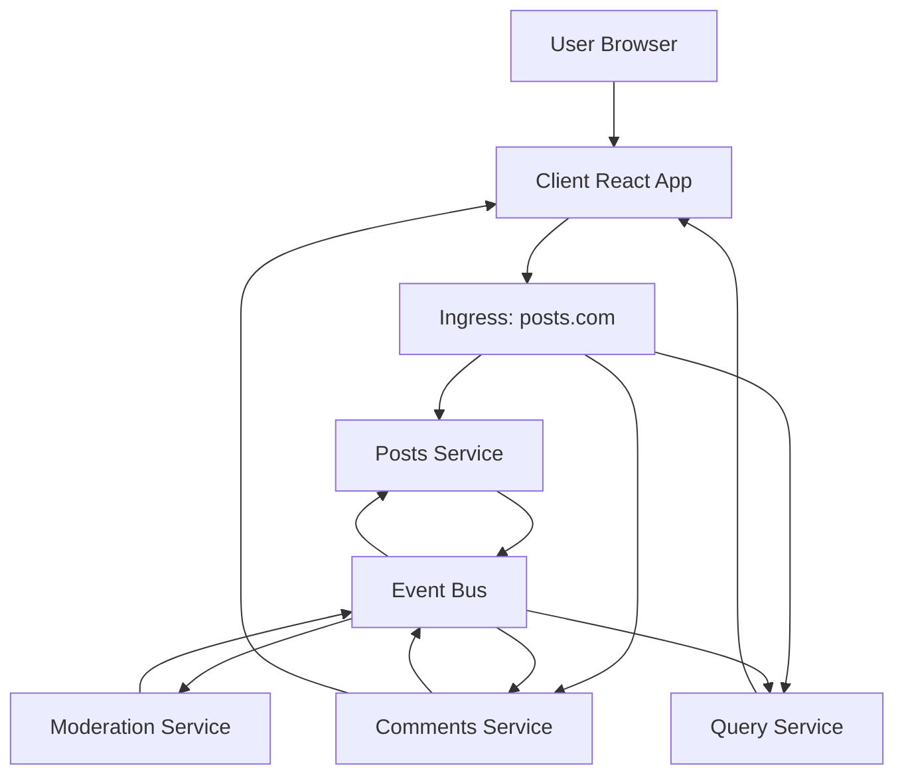
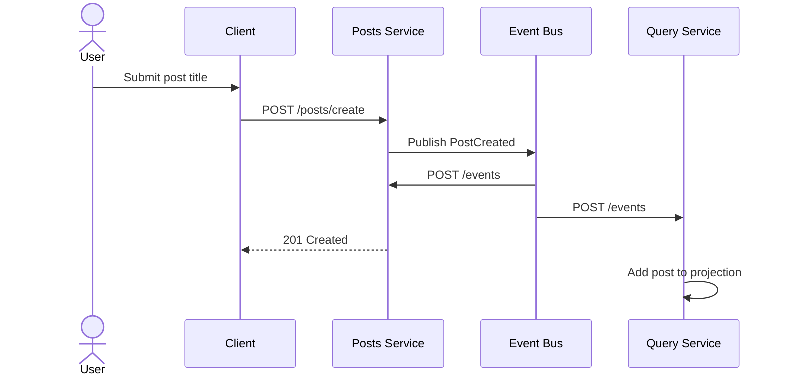
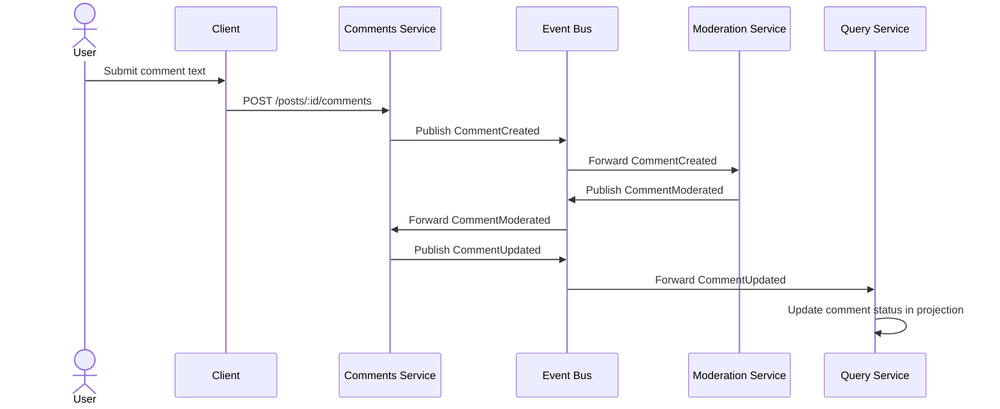
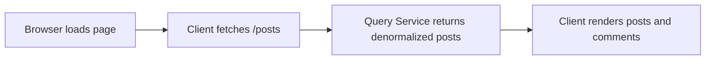

# Blog Boilerplate Microservices

This repository is a small event-driven blog platform built to demonstrate a practical microservices architecture. The application is intentionally split into small services so each one owns a single responsibility: posting content, collecting comments, moderating comments, projecting a read model, and relaying events between services.

At a high level, the system uses a write side and a read side:

- The write side accepts post and comment commands.
- The event bus forwards domain events to every service.
- The query service builds a denormalized read model for the UI.
- The moderation service applies an automated moderation rule.

## Repository Structure

The repository is organized by deployable unit. Each top-level service folder contains its own `Dockerfile`, `package.json`, and runtime entry point.

```text
blog-boilerplate/
├── client/
│   ├── Dockerfile
│   ├── package.json
│   └── src/
│       ├── App.jsx
│       ├── CommentCreate.jsx
│       ├── CommentList.jsx
│       ├── PostCreate.jsx
│       ├── PostList.jsx
│       ├── index.css
│       ├── main.jsx
│       └── server.js
├── comments/
│   ├── Dockerfile
│   ├── index.js
│   └── package.json
├── event-bus/
│   ├── Dockerfile
│   ├── index.js
│   └── package.json
├── moderation/
│   ├── Dockerfile
│   ├── index.js
│   └── package.json
├── posts/
│   ├── Dockerfile
│   ├── index.js
│   └── package.json
├── query/
│   ├── Dockerfile
│   ├── index.js
│   └── package.json
├── infra/
│   └── k8s/
│       ├── client-depl.yaml
│       ├── comments-depl.yaml
│       ├── event-bus-depl.yaml
│       ├── ingress-srv.yaml
│       ├── moderation-depl.yaml
│       ├── posts-depl.yaml
│       ├── posts-srv.yaml
│       └── query-depl.yaml
├── skaffold.yaml
└── README.md
```

## Service Responsibilities

### Client

The `client/` app is the React front end. It renders the blog UI, creates posts, creates comments, and displays the projected read model.

- `App.jsx` composes the page.
- `PostCreate.jsx` sends post creation requests.
- `PostList.jsx` fetches the current post projection.
- `CommentCreate.jsx` submits comments for a selected post.
- `CommentList.jsx` renders moderated comment state.
- `server.js` points the browser app at the public blog host (`posts.com`).

### Posts Service

The `posts/` service owns post creation.

- `POST /posts/create` creates a post and publishes a `PostCreated` event.
- `GET /posts` returns the in-memory post list.
- `POST /events` receives all broadcast events.

This service is the command entry point for new posts.

### Comments Service

The `comments/` service owns comment creation and moderation updates.

- `POST /posts/:id/comments` creates a comment with `pending` status and publishes a `CommentCreated` event.
- `GET /posts/:id/comments` returns comments for a post.
- `POST /events` listens for `CommentModerated` and then publishes `CommentUpdated`.

### Moderation Service

The `moderation/` service simulates a background moderation workflow.

- It listens for `CommentCreated`.
- It marks comments as `rejected` when the content contains `orange`.
- Otherwise it approves the comment.
- It publishes `CommentModerated` back to the event bus.

### Query Service

The `query/` service builds the read model used by the UI.

- `GET /posts` returns the denormalized projection.
- `POST /events` updates the projection from incoming events.
- On startup it hydrates its cache from the event bus history.

This is the read side of the system and is the main example of CQRS-style separation in the project.

### Event Bus

The `event-bus/` service is the event router.

- `POST /events` stores each event and forwards it to every service.
- `GET /events` returns event history for debugging and replay.

It is the central transport that keeps the services loosely coupled.

## Architecture Design

The diagram below shows the main runtime topology.



### Why this design works

- The UI never talks directly to internal service pods.
- Commands and events are separated, which keeps the write path simple.
- The query model can be rebuilt from the event stream at any time.
- Each service can scale independently.

## Flow Design

### 1. Create a Post



### 2. Create and Moderate a Comment



### 3. Read the Blog Feed



## Case Study: A Single Comment Through the System

This project is a good case study for eventual consistency because the user does not see all data become consistent in a single synchronous transaction. Instead, the platform converges through events.

Scenario:

1. A user creates a post titled `Microservices in Practice`.
2. The posts service stores the post and emits `PostCreated`.
3. The query service adds the new post to its read model.
4. A second user adds the comment `orange is my favorite color`.
5. The comments service stores it with `pending` status and emits `CommentCreated`.
6. The moderation service sees the word `orange`, marks the comment as `rejected`, and emits `CommentModerated`.
7. The comments service updates the comment and emits `CommentUpdated`.
8. The query service updates its projection, so the UI now shows the rejection state.

What this demonstrates:

- The write path stays small and fast.
- The moderation rule is isolated from the comment creation path.
- The UI reads from a projection optimized for display.
- Services exchange events instead of sharing a database.

## Kubernetes Topology

The `infra/k8s/` folder contains the deployment manifests for each service and the ingress routing rules.

- `client-depl.yaml` exposes the React app.
- `posts-depl.yaml` and `posts-srv.yaml` expose the posts service.
- `comments-depl.yaml` exposes the comments service.
- `query-depl.yaml` exposes the query service.
- `moderation-depl.yaml` exposes the moderation service.
- `event-bus-depl.yaml` exposes the event bus.
- `ingress-srv.yaml` routes external traffic from `posts.com`.

Ingress routing is configured so that:

- `/posts/create` goes to the posts service.
- `/posts` goes to the query service.
- `/posts/:id/comments` goes to the comments service.
- everything else goes to the client.

## Runtime Contracts

The services communicate with a small set of events:

- `PostCreated`
- `CommentCreated`
- `CommentModerated`
- `CommentUpdated`

The event bus fans each event out to all services, and each service decides whether it cares about the payload.

## Local Development

The repository is set up for containerized local development and Kubernetes deployment.

Typical workflow:

1. Build the service images.
2. Apply the Kubernetes manifests.
3. Route browser traffic through the ingress host `posts.com`.
4. Use the client UI to create posts and comments.

If you use Skaffold, the `skaffold.yaml` file coordinates the build and deploy loop.

## Key Takeaways

- This is an event-driven blog with separate command and query services.
- The event bus is the backbone of service communication.
- Comment moderation is asynchronous and rule-based.
- The UI reads from a projection, not from the write models directly.
- The project is a compact reference for CQRS-style microservice design.
